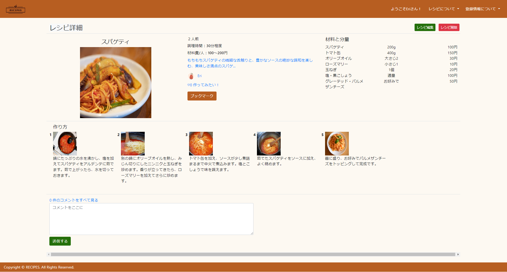
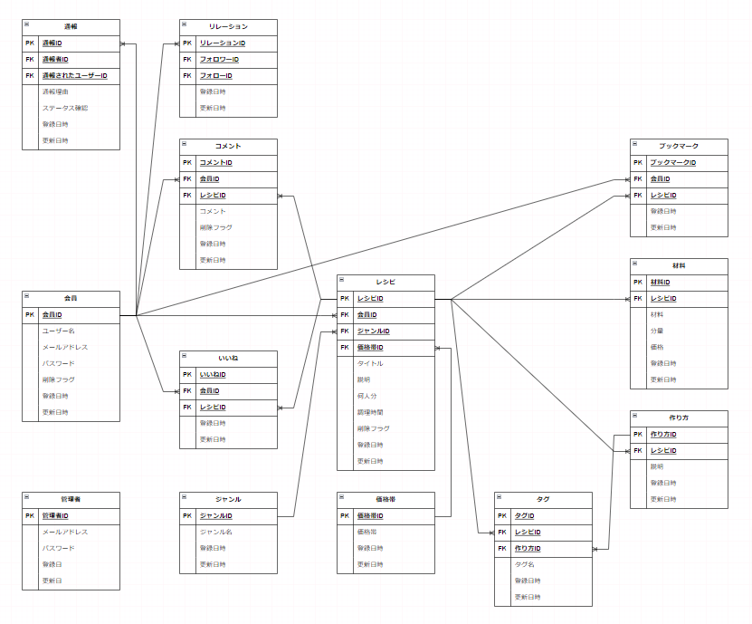

# RECIPES
[こちら](http://35.77.54.205/)からサイトへのアクセスが可能です。

## サイト概要

### サイトテーマ
自分が作った料理を投稿したり、他のユーザーが投稿した料理について 
材料費やカテゴリー別に検索できるSNSサイト
​
### テーマを選んだ理由
日頃、料理の献立を考える際に材料費の予算や作りたい料理のジャンルを考慮することがあります。 
その際に、手軽にこれらの情報を検索できるアプリがあれば便利だと考えました。 
忙しい社会人の方や学生などのユーザーは、予算内で簡単に作れる料理のレシピを探したり 
特定のジャンルの料理を見つけたりしたい時があるのではないかと思います。 
自分が作りたい料理のレシピを、様々な場面において手間なく探せるアプリを作りたいと考え、 
このテーマにしました。

### ターゲットユーザー
- 様々な条件に合わせて、作りたいレシピを手間なく探したい人
- SNSで自分が作ったレシピを発信することで、楽しく料理を作りたい人

### 主な利用シーン
- 限られた予算の中で、作れる料理を探したい時
- 特定のジャンルから作りたい料理のレシピを探したい時
- フォローしているユーザーが作ったレシピを見たい時　等

## 設計書
- [機能一覧](https://docs.google.com/spreadsheets/d/1JDppa8nSIQzA-cBbLt10_6sFv0_wO5THL_cUynzovv0/edit?usp=sharing)
- ER図

- [テーブル定義書](https://docs.google.com/spreadsheets/d/1nnshbtLZcN0bYeOM3KJDRzxWb1Lm1Jy8yUglrrD6Z_s/edit?usp=sharing)
​
## 開発環境
- OS：Linux
- 言語：HTML,CSS,JavaScript,Ruby,MySQL
- フレームワーク：Ruby on Rails
- JSライブラリ：jQuery
- IDE：Cloud9
​
## 使用素材
- ロゴの使用：「hatchful」https://www.shopify.com/jp/tools/logo-maker
- ロゴの使用：「DesignEvo」https://www.designevo.com/jp/
- イラストの使用：「イラストAC」https://www.ac-illust.com/
- 画像の使用：「写真AC」https://www.photo-ac.com/
- 画像の使用：「Stable Diffusion Reimagine」https://clipdrop.co/stable-diffusion-reimagine
- 画像の使用：「o-dan」https://o-dan.net/ja/
